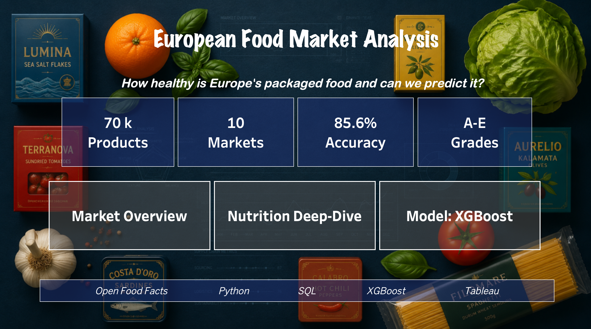
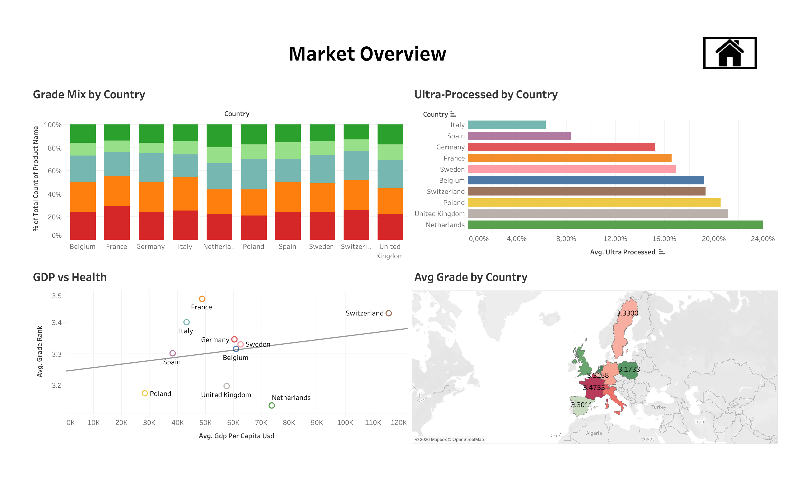
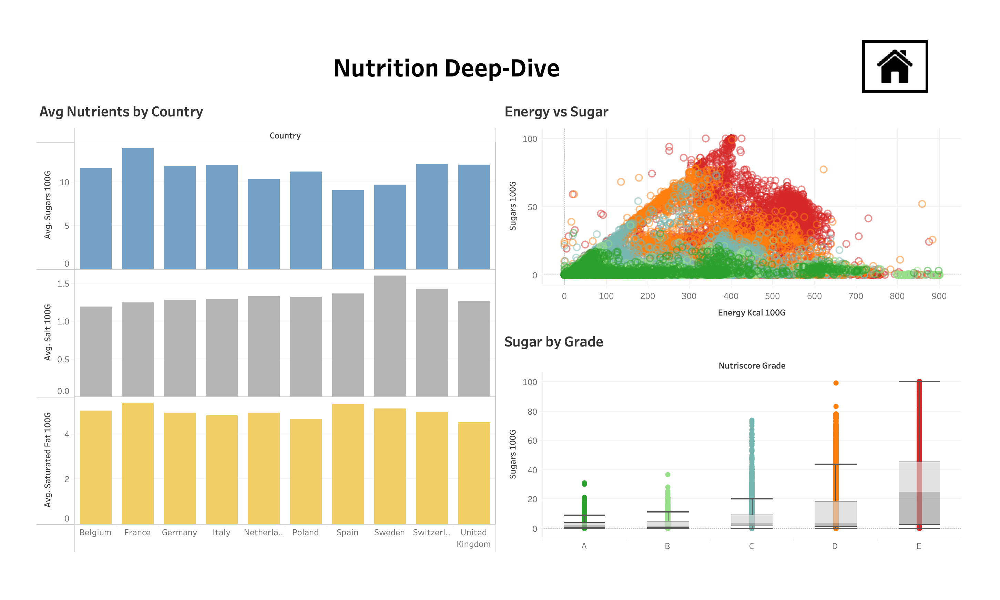
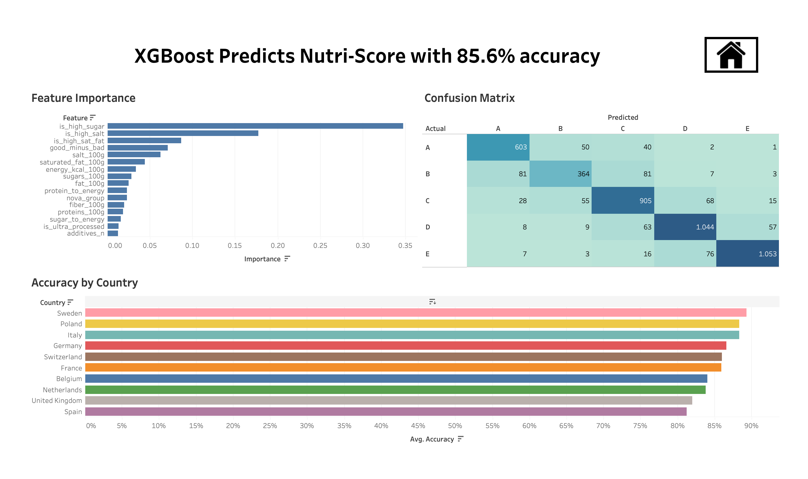
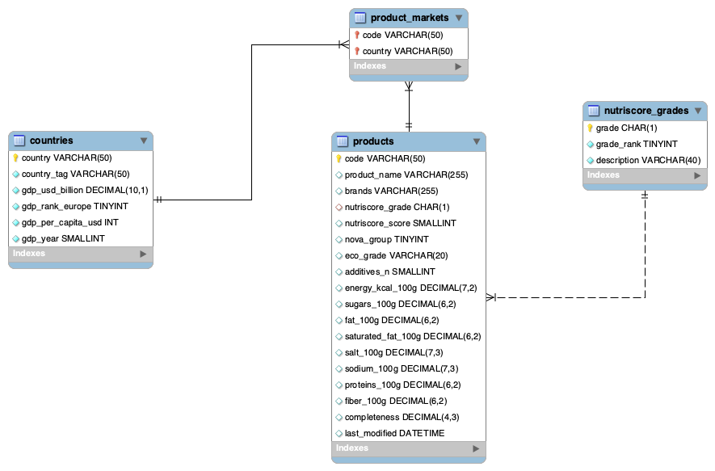

# European Food Market Analysis

Analysing the packaged-food market across **Europe's 10 largest economies** using the
[Open Food Facts](https://world.openfoodfacts.org) open database - combining a Python
data pipeline, a normalized MySQL database, an XGBoost prediction model, and interactive
Tableau dashboards.

### 🔗 [View the live interactive dashboards on Tableau Public →](https://public.tableau.com/views/EuropeanFoodMarketAnalysis/HOME)

### 📊 [View the presentation slides →](https://docs.google.com/presentation/d/1THOODetxt9V5P4P9ZXrM3AzvR1Dh85dn2vmCU432KgM/edit?usp=sharing)

**Stack:** Python · SQL (MySQL) · DuckDB · XGBoost · Tableau

---

## The question

> **How healthy is Europe's packaged food - and can we predict it?**

Three angles answer it:
1. **Compare the markets** - how food quality, processing, and nutrition differ across 10 countries
2. **Predict the Nutri-Score** - can a model assign a grade (A–E) from nutrition facts alone?
3. **Link food to economics** - does a country's wealth track how healthy its food catalogue is?

---

## Key findings

- **Europe's packaged food skews unhealthy.** Across all 10 markets, grades D and E dominate
  the catalogue, and A/B (the healthiest) form only a thin top band.
- **Wealth does *not* predict healthier food.** Comparing GDP per capita against average
  Nutri-Score shows no meaningful relationship - the richest markets (Switzerland, Netherlands)
  sit at the same grade level as much poorer ones, pushing back on the intuitive
  "richer = healthier" assumption.
- **Sugar is the clearest driver of grade.** Average sugar climbs steadily from grade A to E.
- **An XGBoost classifier predicts the Nutri-Score grade with 85.6% accuracy** on held-out
  products. Its strongest predictors - high sugar, high salt, high saturated fat - mirror how
  the official Nutri-Score is actually calculated, confirming the model learned the right
  patterns. Errors are almost entirely between *adjacent* grades.

---

## Dashboards

### Home


### Market Overview


### Nutrition Deep-Dive


### Model Results


---

## Database schema

The flat extract is normalized into a small star schema - `products` (one row per barcode),
`countries` (market + GDP), `nutriscore_grades` (A–E lookup), and `product_markets` (a bridge
table modelling the many-to-many between products and the markets that sell them).



---

## How it works (the pipeline)

```
extract_parquet.py   Open Food Facts Parquet (Hugging Face) -> European slice   (~2.6M rows)
      |              read + filtered with DuckDB (SQL over Parquet)
      v
sample_data.py       balanced sample of 7,000 products per country              (~70k rows)
      |
      v
01 extraction&loading   load the sampled data
02 cleaning&wrangling   clean text, fix impossible values, handle missing data  -> products_clean.csv
      |
      +--> 03 sql_validation   load into a normalized 4-table MySQL schema, validate with JOINs
      |
      v
04 feature_engineering  encode target A-E -> 0-4, build ratio/flag features     -> products_features.csv
      |
      v
05 modelling            train + evaluate XGBoost (85.6% accuracy)               -> model_*.csv
      |
      v
Tableau                 3 linked dashboards + a landing page
```

An additional `extract_api.py` demonstrates live Open Food Facts API consumption
(rate-limited) on a small sample - a complement to the bulk Parquet extraction.

---

## Repository structure

```
├── notebooks/
│   ├── 01_data_extraction&loading.ipynb   # extraction + loading
│   ├── 02_data_cleaning&wrangling.ipynb    # cleaning + wrangling
│   ├── 03_sql_validation.ipynb             # MySQL schema, load, validate with JOINs
│   ├── 04_feature_engineering.ipynb        # model-ready features (pandas)
│   ├── 05_modelling.ipynb                  # XGBoost classifier + evaluation
│   └── schema.sql                          # normalized 4-table schema + reference data
├── extract_parquet.py                      # bulk extraction (DuckDB + Parquet)
├── sample_data.py                          # balanced per-country sampling
├── extract_api.py                          # live API extraction (demo / sample)
├── images/                                 # dashboard screenshots + ERP diagram
├── European Food Market Analysis.twb       # Tableau workbook (source)
├── requirements.txt
└── README.md
```

> **Note:** the raw and processed data files (`data/`, `*.csv`, `*.parquet`) are **not**
> included in the repo - they are large and fully reproducible by running the pipeline
> below. The dashboards are hosted live on Tableau Public (link above).

---

## Reproduce it

```bash
# 1. install dependencies
pip install -r requirements.txt

# 2. extract the European data (creates data/products_europe.csv)
python extract_parquet.py

# 3. sample down to a balanced ~70k rows
python sample_data.py

# 4. run the notebooks in order: 01 -> 02 -> 03 -> 04 -> 05
#    (03 needs a running MySQL server + a .env file with your DB credentials)
```

The SQL step (`03`) requires MySQL running and a `.env` file with `DB_HOST`, `DB_PORT`,
`DB_USER`, `DB_PASSWORD`, `DB_NAME`.

---

## Notes & limitations

Open Food Facts is **crowd-sourced** and skews heavily toward French products (France alone
is ~43% of the full catalogue), so these findings describe *"products catalogued in Open Food
Facts,"* not necessarily each country's true retail market. Data completeness varies by
country and field, and the GDP-vs-health comparison uses 10 data points, so it's an observed
pattern rather than a statistically proven law. These are stated openly as part of the analysis.

---

## Data & licensing

Data © [Open Food Facts](https://world.openfoodfacts.org) contributors, under the
[Open Database License (ODbL)](https://opendatacommons.org/licenses/odbl/1-0/).
GDP figures: IMF World Economic Outlook (2025 nominal estimates).

---

## Author

**Kanak Yadav** - Data Analyst
[Portfolio](https://kanak2208.github.io) · [LinkedIn](https://www.linkedin.com/in/kanakyadav22) · [GitHub](https://github.com/Kanak2208)
